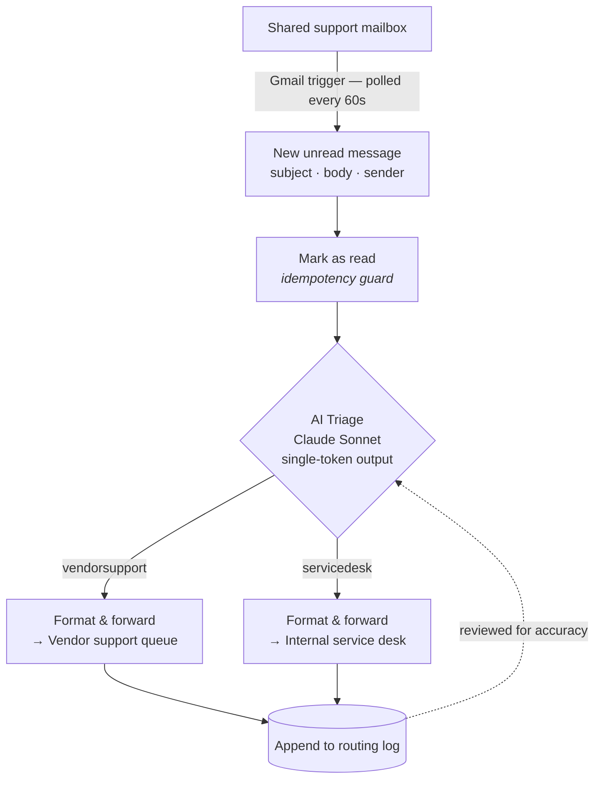

# Email Triage & Routing Agent

> An LLM classifier sitting on a shared support mailbox that decides who owns each incoming request and forwards it there — removing a manual handoff that accounted for ~92% of the queue.

| | |
|---|---|
| **Status** | Live in production |
| **My role** | Solo — research, design, build, deployment |
| **Stack** | n8n · Anthropic Claude (Sonnet) · Gmail API · Google Sheets |
| **Volume** | ~300 emails/month |

[← Back to portfolio](../README.md)

---

## The Problem

A shared support mailbox for a multi-location franchise brand received requests spanning two unrelated support domains:

- **Camera / AV equipment** — owned and serviced by a third-party vendor
- **Internal IT systems** — accounts, access, reservations, non-AV hardware — owned by the corporate service desk

Every message landed in the same inbox. The internal service desk opened each one, determined ownership, and manually re-forwarded the majority to the vendor. **Roughly 92% of that volume belonged to the vendor** — about 275 manual handoffs a month spent reading, reformatting, and forwarding email.

The cost wasn't just labor. Every handoff added queue latency before the team that owned the problem ever saw the request.

## What It Does

The agent watches the mailbox continuously, classifies each new message by ownership domain, and forwards it to the responsible team in a clean, standardized format — with the original requester's name and address carried in the message body, so the receiving team always knows who reported the problem.

## Architecture

## How It Works

**1. Ingest.** A Gmail trigger polls the mailbox once a minute and pulls full detail on any unread message — subject, body, sender, HTML.

**2. Idempotency guard.** The message is marked read *before* classification, so a long-running or failed execution can't cause the same email to be processed twice on the next poll.

**3. Classification.** Subject and body go to Claude with a routing prompt that encodes an ordered decision ladder rather than a flat list of categories:

| Step | Condition | Route |
|---|---|---|
| 1 | Two distinct problems spanning both domains | Service desk |
| 2 | Camera/screen/audio equipment or its output — feeds, footage, layout, resets, purchases | Vendor |
| 3 | Streaming-platform accounts, access, or service outages | Service desk |
| 4 | Any other internal system — reservations, non-AV hardware | Service desk |
| 5 | Undeterminable | Service desk (human follow-up) |

Order matters: an email touching both domains has one correct route, and the ladder settles it the same way every time.

**4. Route.** A Switch node string-matches the model's output and branches.

**5. Deliver.** The original message is wrapped in a styled HTML template — a "Triaged as…" banner plus sender, address, and subject metadata above the original body — and forwarded with a subject-line prefix identifying the routing decision.

**6. Log the decision.** Each branch appends a row to a shared routing log after the forward succeeds. The log is the team's audit trail: it makes every routing decision reviewable after the fact, so accuracy can be sampled deliberately rather than noticed by accident. Logging sits *after* delivery on purpose — a failure to record must never prevent a request from reaching the team that can resolve it.

**Failures surface in chat.** If an execution fails at any step, the workflow posts to the team's channel. Anything running unattended needs a way to say when it has stopped, so the team hears it from the workflow rather than from a customer following up.

## Design Decisions & Guardrails

**A strict single-token output contract.** The model must return exactly one word. The downstream Switch node string-matches that token, so any preamble, explanation, or trailing punctuation breaks routing. The prompt states that contract explicitly, so the output format is treated as load-bearing rather than cosmetic.

**Fail safe toward a human, never toward a drop.** Ambiguity routes to the internal service desk. A misrouted ticket costs one forward; a dropped ticket costs a customer.

**Grounded in real history.** The routing logic was built from support requests extracted from historical tickets, so the categories reflect what people actually write in — and the model has explicit latitude to make judgement calls on requests that don't match a known pattern.

**Hardened against messy real-world email.** The prompt is guarded against signature blocks and footers, forwarded and nested threads, vague symptom descriptions with no named system, and prompt-injection attempts embedded in forwarded content.

**A closed loop on misroutes.** Correctness is verified three ways: an append-only routing log the team reviews, spot checks on the internal side, and a standing arrangement with the vendor to route misclassified tickets back with the reasoning attached. Those returns aren't just corrections — they feed the knowledge corpus the routing logic is built from, so each misroute measurably improves the next classification.

**The audit trail came from the team.** The workflow shipped without it and worked well. The log was added because of a question the team kept asking — *how do we know it's right?* — so it answers the question they actually had rather than one I guessed at up front.

## Results

**Time-to-support collapsed from up to an hour to under a minute.** This is the outcome that mattered most. Previously a request waited in the internal queue until a technician was free to look at it — sometimes 30 to 60 minutes — before it was even forwarded to the team that owned it. The customer's clock started over at that point. Now the vendor's system receives the request and opens a ticket within a minute of it arriving, regardless of internal queue depth.

**~275 manual handoffs eliminated per month.** At 1–2 minutes each, that's roughly 5–9 hours a month of pure re-forwarding recovered — and more importantly, an entire category of work the internal desk no longer touches.

**Fully unattended, but not unmonitored.** The workflow runs continuously with no human in the loop — and pages the team in chat if it stops working.

**Roughly $0.10–0.20/day in model cost** — about $5 a month to permanently remove a category of work from the team's queue.

## What I'd Build Next

- Confidence scoring on the classification, with low-confidence messages flagged for review rather than silently defaulting
- A third route for requests that a knowledge base article could deflect entirely
- Turning the routing log into a running accuracy metric, so misroute rate is a number on a dashboard rather than a periodic manual review
- Feeding logged corrections back into the routing logic as labeled examples

---

[← Back to portfolio](../README.md)
