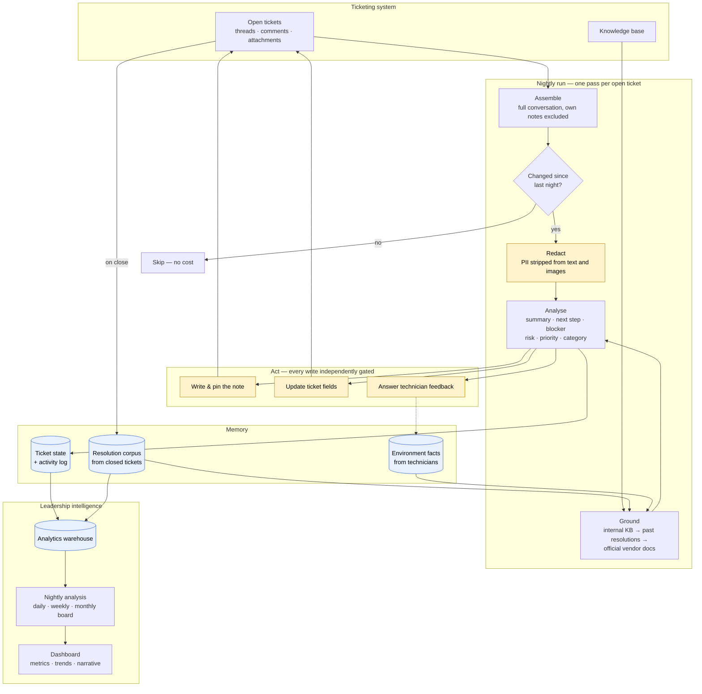
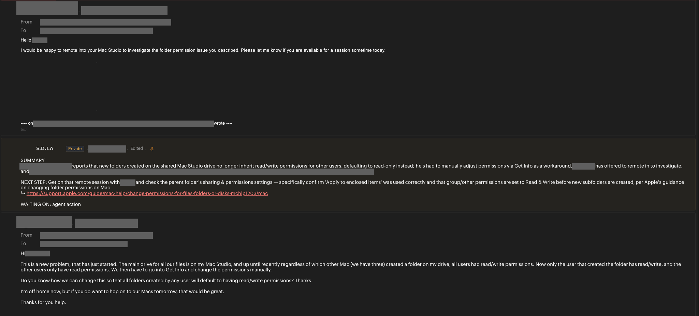
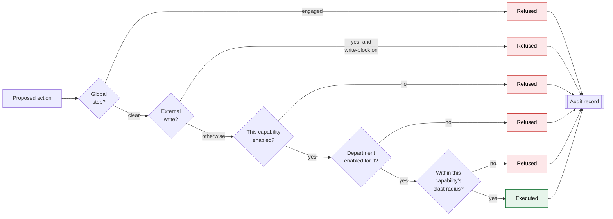
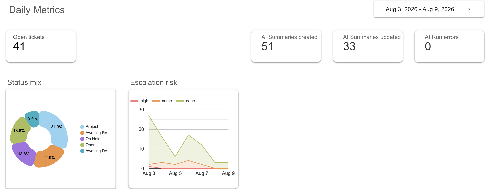
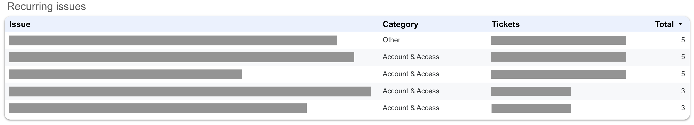
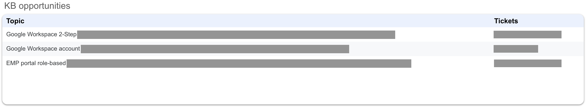

# Service Desk Intelligence Agent

> An autonomous teammate for an IT help desk. Every night it reads every open ticket the way a senior technician would, leaves a grounded note saying what's happening and what to do next, and turns a month of that work into a narrative leadership can read end to end.

| | |
|---|---|
| **Status** | Live in production since July 2026 |
| **My role** | Solo — research, design, build, deployment |
| **Stack** | Python · Anthropic Claude (vision + text) · Firestore · Looker · Zoho Desk API · GCP |
| **Scope** | ~1,000 tickets/month across a multi-brand franchise service desk |

It works *inside* the desk, on the team's side of the ticket — everything it writes is for the technicians, never for the customer.

[← Back to portfolio](../README.md)

---

## The Problem

**Re-explanation was the tax on every ticket.** A ticket open for nine days is a wall of forwarded email, half of it quoted twice. Nothing in it says where things stand, so every time the ticket comes up someone has to reconstruct the story from the thread and explain it again.

**Standups ran on reconstruction.** Morning standup meant reading through email chains that had no summary, just to say what a ticket was actually about — time spent re-establishing context rather than deciding what to do next.

**Covering for each other was hardest.** A technician picking up a colleague's ticket inherited the thread with no orientation. Finding the one detail that mattered meant reading the whole chain.

**"What was I waiting for?"** Without an explicit blocker, a queue can only be triaged by re-reading it.

**Screenshots are invisible.** Customers paste error dialogs, settings panes, and console output. That content is often the whole diagnosis, and no automation was reading it.

**The desk kept re-solving its own problems.** A fix a colleague found last month lived only in a closed ticket.

**Leadership had counts, not a picture.** Volume and status mix don't answer *what's causing a spike* without a deeper dive, *which tickets are about to go wrong*, or *where our documentation has holes*.

## What It Does

Each night, one pass per open ticket: read the full history, decide whether anything actually changed, redact, ground against internal knowledge, analyze, then write a single note — edited in place each night and pinned to the top of the conversation, so the ticket always carries one current summary.

Everything it derives flows into an analytics warehouse that drives a three-cadence leadership dashboard.

## Architecture

## How It Works

**Read.** The agent pulls each open ticket's full history — complete email threads, internal comments, image attachments. Its own previous notes are excluded *by author identity*, so each night's read starts fresh from the conversation itself.

**Decide whether to think at all.** A fingerprint of the ticket's content is compared against last night's. Unchanged tickets are skipped entirely — no analysis, no cost. **Spend tracks how much actually happened on the desk that day, not how many tickets are open.**

**Redact.** Before any content reaches a model it passes a redaction gate: phone numbers, payment details, government IDs, credentials, and health identifiers are stripped from text and blacked out inside screenshots.

**Ground, then analyse.** Internal knowledge comes first: the knowledge base, the resolution corpus, and environment facts the team has taught it. Only when nothing internal applies does it consult official vendor documentation. Every cited link is verified against what was actually retrieved, so every link in a note opens a document that exists.

**Act, within limits.** Writing the note, pinning it, updating a field, and replying to feedback are four separate permissions with four separate switches and four separate blast radii. Enabling one never enables another.

**Remember.** Closed tickets are distilled into structured resolution records — problem, root cause, the steps that actually worked — which feed tomorrow's grounding.

## What a Technician Sees

One note per ticket, pinned so it stays visible as new mail arrives:

*The note sits between the technician's last reply and the requester's original message — summary, next step, blocker, and a knowledge-base link verified against what was actually retrieved.*

The note is deliberately quiet. Risk appears only when elevated. A field change is mentioned only when one was actually made. A calm ticket ends at `WAITING ON:`, so anything that does appear is there for a reason.

**It listens.** A technician types `#feedback` in a private comment — *"this is a test ticket," "the customer already tried that"* — and the next note reflects it, with a short reply explaining what changed. Facts that hold across the whole environment (`#feedbackenv`) are remembered for every future ticket. Jokes are ignored, politely.

## Safety Architecture

The design assumes it will be wrong about something eventually, and is built so that being wrong stays cheap.

**Every capability has its own blast radius.** A feature can be limited to a single designated test ticket while other features run across the whole desk. That makes *"prove it on one ticket first"* something the code enforces — the limit lives inside the write client, so every path to a write goes through it.

**The agent defers to people.** It permanently stands down on any ticket a human has corrected — it never fights a technician's judgment.

**Untrusted content is treated as untrusted.** Ticket text and screenshots come from outside the company. Instructions embedded in them are treated as information to report, never as commands to follow, and an apparent manipulation attempt is flagged on the note for a human to verify.

**Everything is observable.** Every executed *or refused* action produces an audit record, and a single status endpoint reports the live permission posture — what's on, what's off, and how far each capability may reach.

## Leadership Intelligence

| Cadence | Answers |
|---|---|
| **Daily** | What happened yesterday? Volume, created vs. closed, status mix, and last night's analysis — recurring issues with the tickets that prove them, suggested actions, knowledge gaps |
| **Rolling 7 days** | Where are we trending? Escalation mix, what's waiting on whom, top categories, KB coverage, and the tickets most at risk right now |
| **Monthly (board)** | What's the story? A plain-language narrative for a non-technical audience alongside intake vs. throughput |

*Operational health and agent health on the same page — `AI Run errors` sits beside the ticket metrics, so the team can judge the reporting and the reporter at the same time.*

Two outputs are worth calling out specifically:

**Escalation risk as early warning, not postmortem.** Risk is assessed per ticket every night from customer sentiment and the inferred urgency of the underlying issue, and priority escalates automatically when risk elevates. Recurring-issue clustering catches the pattern — a phishing wave, a failing integration — while it is still one story rather than a dozen separate tickets.

*Each cluster carries the tickets that prove it, so any pattern it reports can be opened and checked. Issue text and ticket IDs redacted; the categories and counts are real.*

**Knowledge-base coverage as a managed metric.** The system tracks how often it has to fall back to an external vendor's documentation because no internal article covered the request. That produces a rolling KB coverage percentage — which now drives quarterly KB growth targets and individual technician contributions. **A gap that used to be invisible became a number with an owner.**

*The gaps are written as article topics rather than error counts, so the output is a work queue someone can pick up and start on.*

## Results

- **Measurably higher technician follow-through.** Ticket ownership and follow-up touch points rose after launch, attributable to the agent surfacing a concrete next step on every ticket
- **Aging and at-risk tickets surface to senior leadership automatically**, with evidence attached, while they're still cheap to fix
- **KB gaps became a tracked, owned metric** tied to quarterly targets
- **Strong voluntary adoption** — technicians share what's working and request roadmap items unprompted
- **Cost proportional to change, not volume** — unchanged tickets are skipped and expensive analysis is cached and reused within a run

## Operating Model

**Everything is versioned** — application code, infrastructure, prompts, and the redaction policy all live in source control, so the exact configuration running in production is reproducible from the repository.

**Changes are reviewed adversarially before shipping.** Every change is examined by independent reviewers looking for ways it could fail, and each finding is verified before it's acted on. Note-facing changes are additionally previewed against real tickets — rendering what the fleet's notes *would* become — before anything deploys.

**Rollback is a minute, not a project.** Narrowing a capability's reach, disabling one feature, engaging the global stop, or returning to a previous build are each one reviewed configuration change.

## What I'd Build Next

The architecture grows along two axes without redesign:

**More capability.** Each new behaviour is proven on a designated test ticket, reviewed adversarially, then widened. Category suggestion, drafting replies for human approval, proactive KB authoring from recurring clusters, and a morning digest all follow that same path.

**More of the organisation.** The system is department-aware by design: each department carries its own enabled features, reach limits, applicable KB sections, and ticket vocabulary. A department that isn't listed is simply out of scope. Expansion is a staged rollout — one department at a time, earning the next one.

---

[← Back to portfolio](../README.md)
